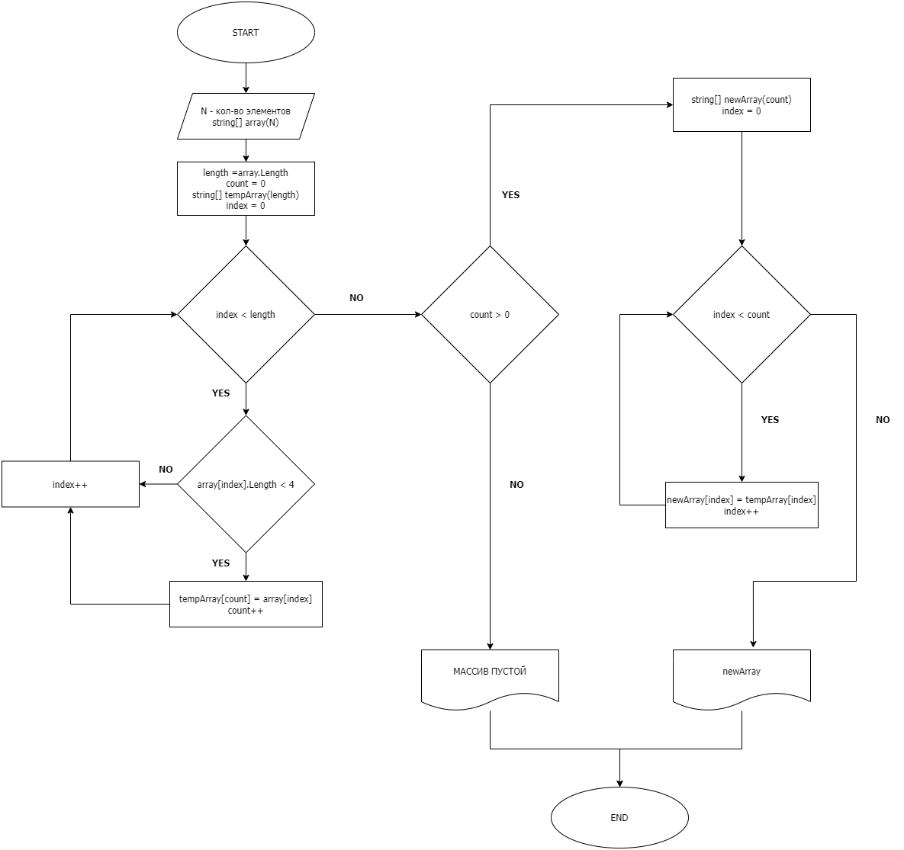

# Алгоритм решения задачи

## Описание задачи

_Написать программу, которая из имеющегося массива строк формирует новый массив из строк, длина которых меньше, либо равна 3 символам. Первоначальный массив можно ввести с клавиатуры, либо задать на старте выполнения алгоритма. При решении не рекомендуется пользоваться коллекциями, лучше обойтись исключительно массивами._

## Предлагаемое решение

__Ввод пользователя__
1. Количество элементов массива (неотрицательное целое число).
2. Элементы массива - произвольный текст.

__Выделение элементов массива с длиной меньшей или равной трем символам__
1. Создание временного массива той же размерности, что и исходный.
2. Перебор элементов исходного массива и проверка длины текста, размещенного в каждой ячейке массива.
3. Если длина элемента не превышает 3 символов, это значение присваивается следующему по очередности элементу временного массива (начиная с 0). Счетчик аккумулирует количество ненулевых элементов временного массива.

Таким образом, мы получаем временный массив, начало которого заполнено элементами исходного массива с длиной не больше 3 символов. Если обнаруживаются элементы длиннее 3 символов, они игнорируются, соответственно, в конце временного массива остаюься пустые элементы. Кроме того, благодаря счетчику мы знаем количество непустых элементов.

__Удаление пустых элементов из временного массива__
1. Создаем новый массив с размерностью, совпадающей с количеством ненулевых элементов во временном массиве.
2. С помощью цикла присваиваем элементам нового массива значения элементов временного массива с тем же индексом.

В итоге мы получаем вариант временного массива, из которого удалены пустые элементы.

Этот алгоритм может быть представлен в виде следующей блок-схемы:

